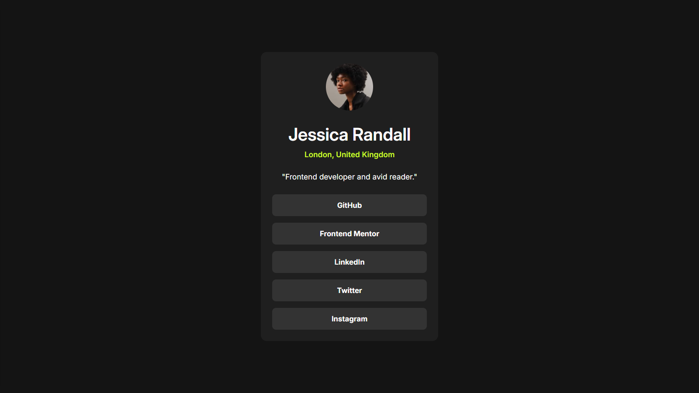

# Frontend Mentor - Social links profile solution

This is a solution to the [Social links profile challenge on Frontend Mentor](https://www.frontendmentor.io/challenges/social-links-profile-UG32l9m6dQ). Frontend Mentor challenges help you improve your coding skills by building realistic projects. 

## Table of contents

- [Overview](#overview)
  - [The challenge](#the-challenge)
  - [Screenshot](#screenshot)
  - [Links](#links)
- [My process](#my-process)
  - [Built with](#built-with)
  - [What I learned](#what-i-learned)
  - [Continued development](#continued-development)
  - [Useful resources](#useful-resources)
  - [AI Collaboration](#ai-collaboration)
- [Author](#author)
- [Acknowledgments](#acknowledgments)

## Overview

### The challenge

Users should be able to:

- See hover and focus states for all interactive elements on the page

### Screenshot

### Links

- Solution URL: (https://www.frontendmentor.io/solutions/social-links-profile-WiAvZLd5_p)
- Live Site URL: (https://blaze-x73.github.io/Frontendmentor-Social-Links-Profile/)

## My process
I started with the basic HTML structure using semantic tags, then I applied basic body styling before styling the card and trying to implement some responsive sizes.

### Built with

- Semantic HTML5 markup
- CSS custom properties
- Flexbox
## Author

- Frontend Mentor - [@Blaze-X73](https://www.frontendmentor.io/profile/Blaze-X73)

## Acknowledgments
My Lord and Saviour Jesus Christ.

